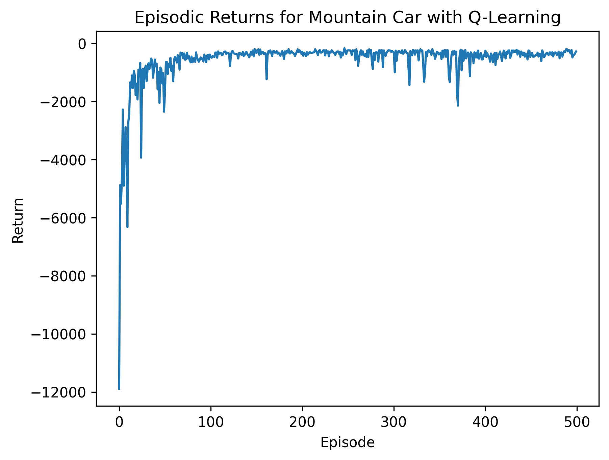
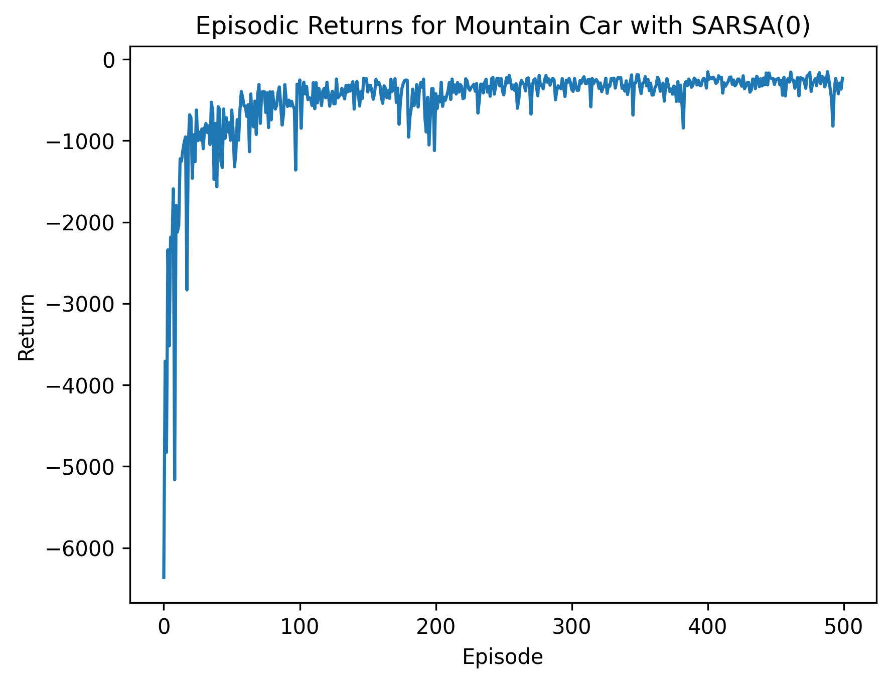
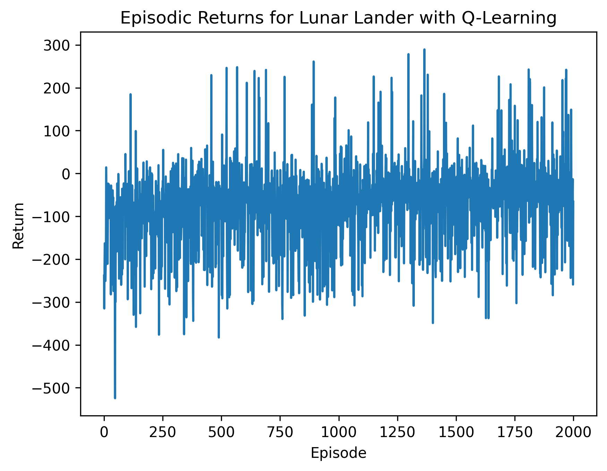
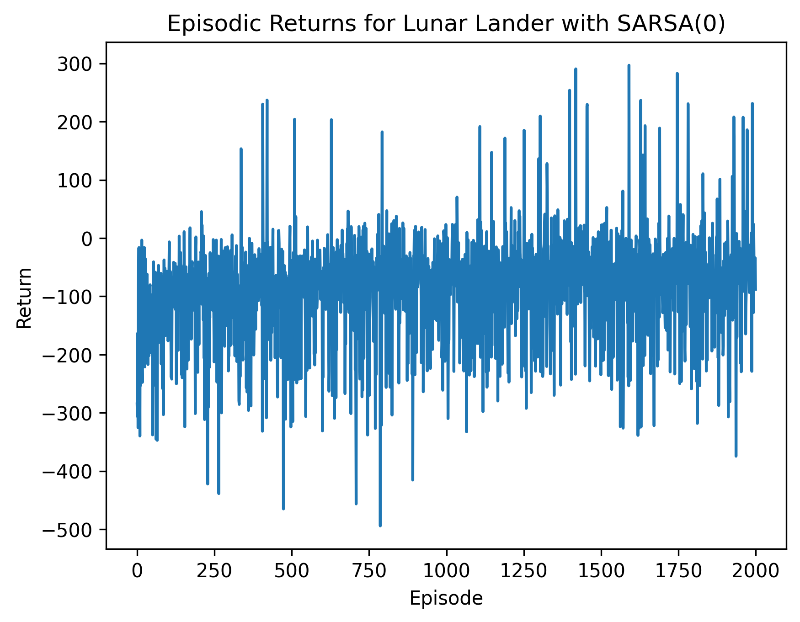
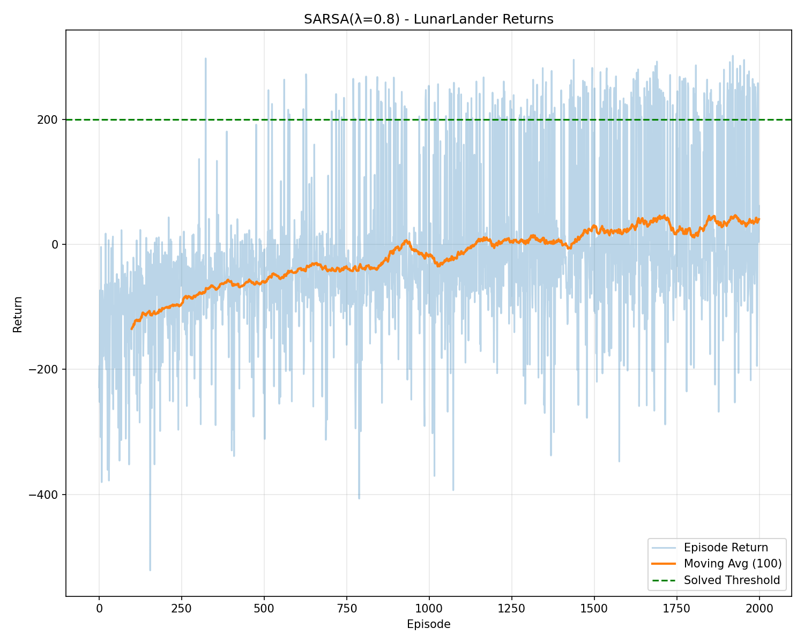

# Reinforcement Learning Assignment 2

This repository contains implementations of various Reinforcement Learning algorithms applied to two classic OpenAI Gymnasium environments: **MountainCar-v0** and **LunarLander-v3**.

## 📋 Table of Contents

- [Overview](#overview)
- [Environments](#environments)
- [Algorithms Implemented](#algorithms-implemented)
- [Project Structure](#project-structure)
- [Configuration](#configuration)
- [Results & Videos](#results--videos)
- [Installation](#installation)
- [Usage](#usage)

## 🎯 Overview

This project demonstrates the application of temporal difference (TD) learning methods to solve control problems in reinforcement learning. The implemented algorithms include Q-Learning, SARSA, and SARSA(λ), showcasing both on-policy and off-policy learning approaches.

## 🎮 Environments

### MountainCar-v0
A classic continuous control problem where an underpowered car must build momentum by moving back and forth to reach the goal at the top of a hill.

- **State Space**: Position and velocity (continuous)
- **Action Space**: 3 discrete actions (push left, no push, push right)
- **Goal**: Reach the flag at the top of the hill

### LunarLander-v3
A space lander must navigate and land safely on a landing pad using its thrusters.

- **State Space**: 8-dimensional (x, y, vx, vy, angle, angular velocity, left leg contact, right leg contact)
- **Action Space**: 4 discrete actions (do nothing, fire left engine, fire main engine, fire right engine)
- **Goal**: Land safely on the landing pad between the flags

## 🧠 Algorithms Implemented

### 1. Q-Learning (Off-Policy TD Control)
Q-Learning is an off-policy algorithm that learns the optimal action-value function regardless of the policy being followed.

**Update Rule:**
```
Q(s,a) ← Q(s,a) + α[r + γ max Q(s',a') - Q(s,a)]
                              a'
```

**Implementations:**
- `MountainCar_Agent_QLearning.py` - Q-Learning for MountainCar
- `LunarLander_Agent_QLearning.py` - Q-Learning for LunarLander

### 2. SARSA (On-Policy TD Control)
SARSA is an on-policy algorithm that learns the value of the policy being followed, including the exploration strategy.

**Update Rule:**
```
Q(s,a) ← Q(s,a) + α[r + γQ(s',a') - Q(s,a)]
```

**Implementations:**
- `MountainCar_SARSA_Agent.py` - SARSA for MountainCar
- `LunarLander_Agent_SARSA_0.py` - SARSA for LunarLander

### 3. SARSA(λ) (On-Policy TD(λ) Control)
SARSA(λ) extends SARSA by using eligibility traces, allowing credit assignment over multiple time steps.

**Update Rule:**
```
δ ← r + γQ(s',a') - Q(s,a)
e(s,a) ← e(s,a) + 1
For all s,a:
    Q(s,a) ← Q(s,a) + αδe(s,a)
    e(s,a) ← γλe(s,a)
```

**Implementation:**
- `LunarLander_Agent_SARSALambda.py` - SARSA(λ) for LunarLander

## 📁 Project Structure

```
.
├── config.py                           # Configuration parameters
├── MountainCar_Agent_QLearning.py      # Q-Learning for MountainCar
├── MountainCar_SARSA_Agent.py          # SARSA for MountainCar
├── LunarLander_Agent_QLearning.py      # Q-Learning for LunarLander
├── LunarLander_Agent_SARSA_0.py        # SARSA for LunarLander
├── LunarLander_Agent_SARSALambda.py    # SARSA(λ) for LunarLander
└── results/                            # Training results, videos, and plots
    ├── mountain_car_qlearning.mp4
    ├── mountain_car_sarsa.mp4
    ├── lunar_lander_qlearning.mp4
    ├── lunar_lander_sarsa.mp4
    ├── sarsa_lambda_lander.mp4
    └── *.png                           # Return plots
```

## ⚙️ Configuration

All hyperparameters are centralized in `config.py`:

| Parameter | Value | Description |
|-----------|-------|-------------|
| `MOUNTAIN_CAR_EPISODES` | 500 | Number of training episodes for MountainCar |
| `LUNAR_LANDER_EPISODES` | 2000 | Number of training episodes for LunarLander |
| `LEARNING_RATE` (α) | 0.1 | Learning rate for Q-value updates |
| `DISCOUNT_FACTOR` (γ) | 0.95 | Discount factor for future rewards |
| `EXPLORATION_FACTOR` (ε) | 0.2 | Epsilon for ε-greedy exploration |
| `LAMBDA` (λ) | 0.8 | Trace decay parameter for SARSA(λ) |

## 🎥 Results & Videos

### MountainCar Environment

#### Q-Learning
[](results/mountain_car_qlearning.mp4)

**Video:** [MountainCar Q-Learning Performance](https://github.com/awaisnazir08/RL_assignment_02/blob/main/results/mountain_car_qlearning.mp4
)

#### SARSA
[](results/mountain_car_sarsa.mp4)

**Video:** [MountainCar SARSA Performance](results/mountain_car_sarsa.mp4)

---

### LunarLander Environment

#### Q-Learning
[](results/lunar_lander_qlearning.mp4)

**Video:** [LunarLander Q-Learning Performance](results/lunar_lander_qlearning.mp4)

#### SARSA
[](results/lunar_lander_sarsa.mp4)

**Video:** [LunarLander SARSA Performance](results/lunar_lander_sarsa.mp4)

#### SARSA(λ)
[](results/sarsa_lambda_lander.mp4)

**Video:** [LunarLander SARSA(λ) Performance](results/sarsa_lambda_lander.mp4)

## 🚀 Installation

### Prerequisites
- Python 3.8+
- pip

### Dependencies

Install the required packages:

```bash
pip install gymnasium numpy imageio matplotlib
```

Or install all dependencies at once:

```bash
pip install gymnasium[box2d] numpy imageio matplotlib
```

**Note:** LunarLander requires the Box2D physics engine, which is included in the `gymnasium[box2d]` installation.

## 💻 Usage

### Running Individual Agents

Each script can be run independently:

```bash
# MountainCar with Q-Learning
python MountainCar_Agent_QLearning.py

# MountainCar with SARSA
python MountainCar_SARSA_Agent.py

# LunarLander with Q-Learning
python LunarLander_Agent_QLearning.py

# LunarLander with SARSA
python LunarLander_Agent_SARSA_0.py

# LunarLander with SARSA(λ)
python LunarLander_Agent_SARSALambda.py
```

### Output

Each script will:
1. Train the agent for the specified number of episodes
2. Display training progress and episode returns
3. Generate a plot of returns over episodes
4. Save a video demonstration of the trained agent
5. Save results in the `results/` directory

### Modifying Hyperparameters

Edit `config.py` to experiment with different hyperparameters:

```python
LEARNING_RATE = 0.1        # Try values between 0.01 and 0.5
DISCOUNT_FACTOR = 0.95     # Typically between 0.9 and 0.99
EXPLORATION_FACTOR = 0.2   # Try values between 0.1 and 0.3
LAMBDA = 0.8               # For SARSA(λ), try values between 0.7 and 0.95
```

## 📊 Key Observations

- **Q-Learning vs SARSA**: Q-Learning (off-policy) tends to learn optimal policies faster but can be less stable during training compared to SARSA (on-policy).
- **SARSA(λ)**: The use of eligibility traces in SARSA(λ) provides faster credit assignment and often results in more efficient learning.
- **State Discretization**: Both environments use discretization to convert continuous state spaces into discrete bins suitable for tabular methods.

## 🔬 Experimental Notes

- The epsilon-greedy exploration strategy balances exploration and exploitation
- State space discretization is crucial for tabular methods in continuous environments
- The number of bins and their ranges significantly affect learning performance
- LunarLander is more complex and requires more episodes to converge

## 📝 License

This project is part of an academic assignment for the Reinforcement Learning course.

## 👥 Author

Created for RL Assignment 2 - 7th Semester

---

**Note**: The videos showcase the trained agents' performance after completing their respective training episodes. The plots demonstrate the learning curves showing episode returns over time.
